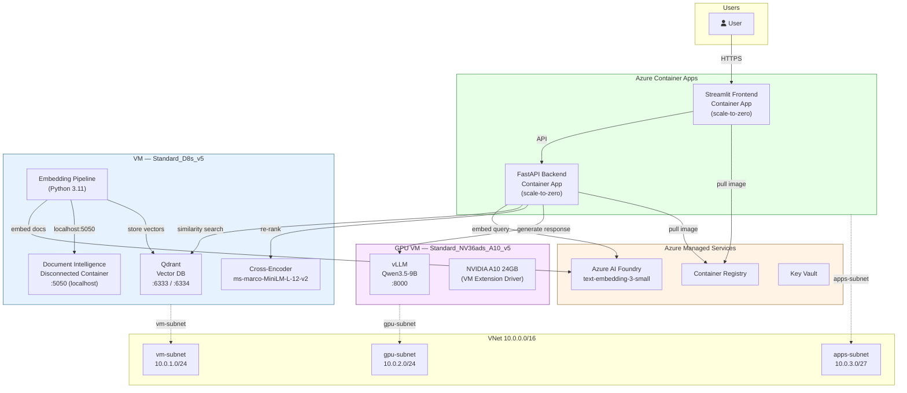
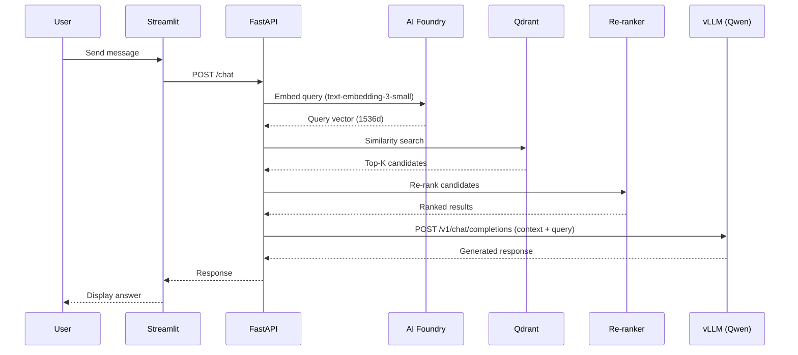
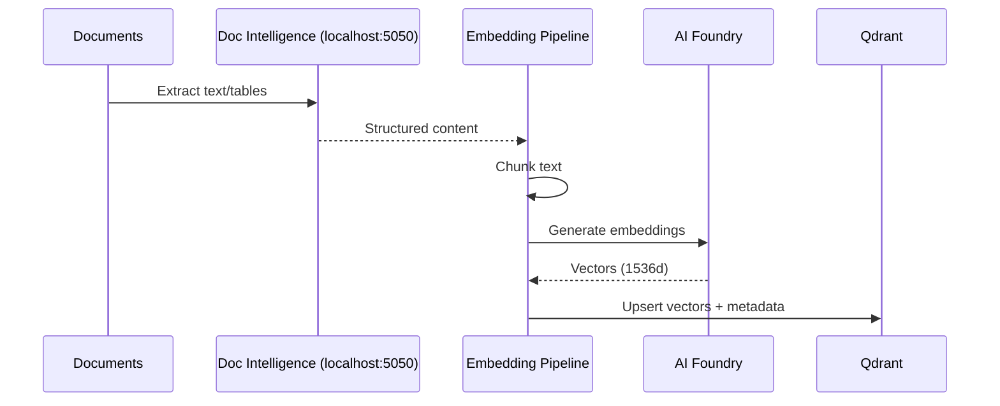

# Architecture Diagrams

## Mermaid (renders in GitHub, VS Code, etc.)

```mermaid
flowchart TB
    subgraph Users
        U[fa:fa-user User]
    end

    subgraph ACA["Azure Container Apps"]
        FE["Streamlit Frontend<br/>Container App<br/>(scale-to-zero)"]
        BE["FastAPI Backend<br/>Container App<br/>(scale-to-zero)"]
    end

    subgraph GPU_VM["GPU VM — Standard_NV36ads_A10_v5"]
        VLLM["vLLM<br/>Qwen3.5-9B<br/>:8000"]
        NVIDIA["NVIDIA A10 24GB<br/>(VM Extension Driver)"]
    end

    subgraph QD_VM["VM — Standard_D8s_v5"]
        QD["Qdrant<br/>Vector DB<br/>:6333 / :6334"]
        DI["Document Intelligence<br/>Disconnected Container<br/>:5050 (localhost)"]
        RERANK["Cross-Encoder<br/>ms-marco-MiniLM-L-12-v2"]
        EMB_PIPE["Embedding Pipeline<br/>(Python 3.11)"]
    end

    subgraph Azure_Services["Azure Managed Services"]
        AI["Azure AI Foundry<br/>text-embedding-3-small"]
        ACR["Container Registry"]
        KV["Key Vault"]
    end

    subgraph Network["VNet 10.0.0.0/16"]
        S1["vm-subnet<br/>10.0.1.0/24"]
        S2["gpu-subnet<br/>10.0.2.0/24"]
        S3["apps-subnet<br/>10.0.3.0/27"]
    end

    U -->|HTTPS| FE
    FE -->|API| BE
    BE -->|embed query| AI
    BE -->|similarity search| QD
    BE -->|re-rank| RERANK
    BE -->|generate response| VLLM

    EMB_PIPE -->|embed docs| AI
    EMB_PIPE -->|localhost:5050| DI
    EMB_PIPE -->|store vectors| QD

    QD_VM -.->|vm-subnet| S1
    GPU_VM -.->|gpu-subnet| S2
    ACA -.->|apps-subnet| S3

    BE -->|pull image| ACR
    FE -->|pull image| ACR

    style GPU_VM fill:#f9e6ff,stroke:#7b2d8e
    style QD_VM fill:#e6f3ff,stroke:#2d6b8e
    style ACA fill:#e6ffe6,stroke:#2d8e3b
    style Azure_Services fill:#fff3e6,stroke:#8e6b2d
```

## Data Flow

```mermaid
sequenceDiagram
    participant U as User
    participant FE as Streamlit
    participant BE as FastAPI
    participant AI as AI Foundry
    participant QD as Qdrant
    participant RR as Re-ranker
    participant LLM as vLLM (Qwen)

    U->>FE: Send message
    FE->>BE: POST /chat
    BE->>AI: Embed query (text-embedding-3-small)
    AI-->>BE: Query vector (1536d)
    BE->>QD: Similarity search
    QD-->>BE: Top-K candidates
    BE->>RR: Re-rank candidates
    RR-->>BE: Ranked results
    BE->>LLM: POST /v1/chat/completions (context + query)
    LLM-->>BE: Generated response
    BE-->>FE: Response
    FE-->>U: Display answer
```

## Ingestion Flow

```mermaid
sequenceDiagram
    participant DOC as Documents
    participant DI as Doc Intelligence (localhost:5050)
    participant EMB as Embedding Pipeline
    participant AI as AI Foundry
    participant QD as Qdrant

    DOC->>DI: Extract text/tables
    DI-->>EMB: Structured content
    EMB->>EMB: Chunk text
    EMB->>AI: Generate embeddings
    AI-->>EMB: Vectors (1536d)
    EMB->>QD: Upsert vectors + metadata
```
