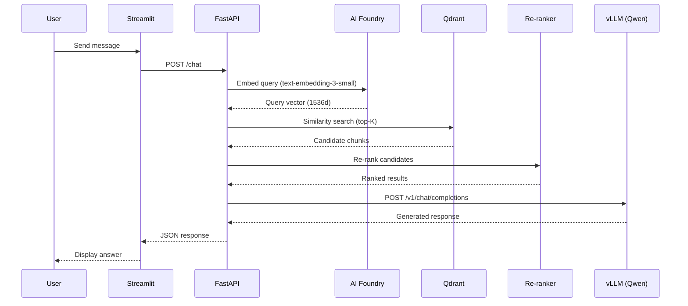
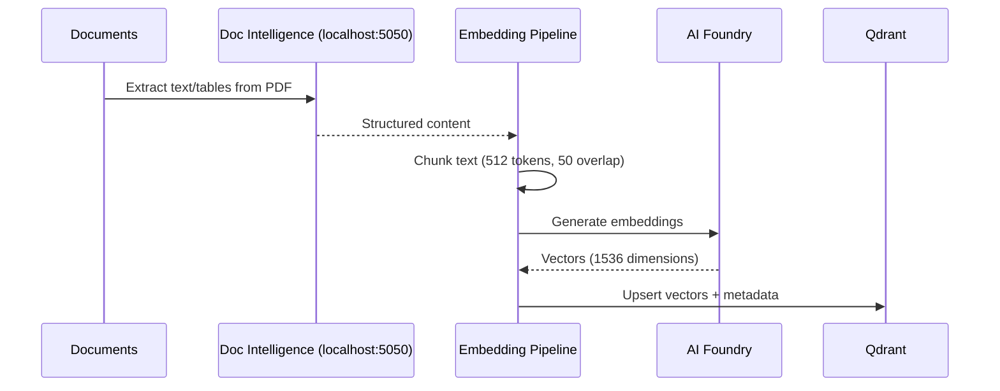

# Module 2 — Architecture
{: .no_toc }

Understand the system design, data flows, and Azure resource layout before deploying.
{: .fs-6 .fw-300 }

<details open markdown="block">
  <summary>Table of contents</summary>
  {: .text-delta }
- TOC
{:toc}
</details>

---

## 2.1 System Overview

The RAG chatbot consists of three planes:

| Plane | Components | Purpose |
|---|---|---|
| **Serving** | Streamlit + FastAPI (Container Apps) | User-facing chatbot interface |
| **Inference** | vLLM + Qwen3.5-9B (GPU VM) | Generate natural language answers |
| **Data** | Qdrant + Doc Intelligence + Embeddings (VM) | Document processing & vector search |

```
User → Streamlit → FastAPI → [embed query] → Qdrant → [re-rank] → vLLM → Response
                                   ↑
                           Azure AI Foundry
                        (text-embedding-3-small)
```

---

## 2.2 Network Architecture

All resources reside in a single VNet with three subnets:

```
VNet: chatbot-dev-vnet (10.0.0.0/16)
├── vm-subnet     (10.0.1.0/24)  → Qdrant VM + Doc Intelligence container
├── gpu-subnet    (10.0.2.0/24)  → GPU VM (vLLM)
└── apps-subnet   (10.0.3.0/27)  → Container Apps Environment
```

### NSG Rules

| Rule | Port | Source | Destination |
|---|---|---|---|
| AllowQdrantFromVNet | 6333, 6334 | VirtualNetwork | vm-subnet |
| AllowVLLMFromVNet | 8000 | VirtualNetwork | gpu-subnet |
| DenyInternetInbound | * | Internet | All subnets |

{: .note }
> Document Intelligence (port 5050) does NOT need an NSG rule — it's accessed via `localhost` on the same VM as the embedding pipeline.

---

## 2.3 Component Details

### Qdrant VM (`Standard_D8s_v5`)

This VM runs three workloads:

| Service | Runtime | Port | Storage |
|---|---|---|---|
| **Qdrant** | Docker container | 6333 (REST), 6334 (gRPC) | `/data/qdrant` |
| **Document Intelligence** | Docker container (disconnected) | 5050 (localhost) | `/data/doc-intel` |
| **Embedding Pipeline** | Python 3.11 venv | — | `/opt/ingestion` |
| **Re-ranker** | Python (sentence-transformers) | — | In-process |

### GPU VM (`Standard_NV36ads_A10_v5`)

| Component | Details |
|---|---|
| **GPU** | NVIDIA A10 (24 GB VRAM) |
| **Driver** | Azure VM Extension (`Microsoft.HpcCompute/NvidiaGpuDriverLinux` v1.6) |
| **vLLM** | Docker `vllm/vllm-openai:latest`, systemd service |
| **Model** | `Qwen/Qwen3.5-9B` (~18 GB VRAM) |
| **API** | OpenAI-compatible at `:8000/v1/chat/completions` |
| **Config** | `--max-model-len 8192 --gpu-memory-utilization 0.9` |

### Container Apps

| App | Framework | Port | Scaling |
|---|---|---|---|
| Frontend | Streamlit | 8501 | 0 → 3 replicas |
| Backend | FastAPI | 8000 | 0 → 3 replicas |

Both use **system-assigned managed identity** for ACR pull and AI Foundry access.

### Azure Managed Services

| Service | Purpose | SKU |
|---|---|---|
| **AI Foundry** | Embeddings (`text-embedding-3-small`) | S0 |
| **Document Intelligence** | Commitment resource (license only) | DC0 |
| **Container Registry** | Store app images | Basic |
| **Key Vault** | Secrets (Qdrant API key, etc.) | Standard |

---

## 2.4 Data Flows

### Query Flow (runtime)



### Ingestion Flow (batch)



---

## 2.5 Security Model

| Principle | Implementation |
|---|---|
| **No hardcoded secrets** | Key Vault + managed identity |
| **Least privilege** | Scoped RBAC roles per resource |
| **Network isolation** | VNet + NSG rules |
| **Private services** | Qdrant & vLLM VNet-only access |
| **Offline document processing** | Doc Intelligence disconnected container |

### RBAC Assignments

| Identity | Role | Scope |
|---|---|---|
| Qdrant VM | `Cognitive Services User` | Resource Group |
| Qdrant VM | `Cognitive Services OpenAI User` | Resource Group |
| Backend App | `Cognitive Services OpenAI User` | Resource Group |
| Backend App | `AcrPull` | Container Registry |
| Frontend App | `AcrPull` | Container Registry |

---

## 2.6 Infrastructure Scripts

The deployment is orchestrated by `deploy.sh` which calls modules in order:

| Step | Script | Resource |
|---|---|---|
| 1 | `resource-group.sh` | Resource Group |
| 2 | `vnet.sh` | VNet + Subnets + NSGs |
| 3 | `acr.sh` | Container Registry |
| 4 | `keyvault.sh` | Key Vault |
| 5 | `ai-foundry.sh` | AI Foundry + Embedding Deployment |
| 6 | `vm.sh` | Qdrant VM (Docker, Qdrant container) |
| 7 | `doc-intelligence.sh` | Commitment resource + disconnected container on VM |
| 8 | `vm-gpu.sh` | GPU VM (NVIDIA driver, vLLM) |
| 9 | `container-app-*.sh` | Container Apps Env + Backend + Frontend |
| 10 | `identity-roles.sh` | RBAC role assignments |

{: .important }
> Step 7 (Doc Intelligence) must run **after** Step 6 (Qdrant VM) because it SSHs into the VM to deploy the disconnected container.

[← Prerequisites](){: .btn .mr-2 }
[Next: Deploy Infrastructure →](){: .btn .btn-primary }
